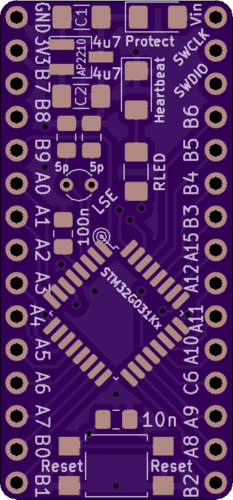

# Simple STM32G031Kx Breakout Board

This is just a simple reference circuit for a 32-pin STM32G031 microcontroller. I tried to make it easy to hand-solder, with everything on one side of the board, wide footprints, and no parts smaller than 0805. The microcontroller also has pins spaced at 0.8mm, which is farther apart than the usual <=0.5mm that you see these days. Some of the parts are a little close together, so you might have to think about the order that you solder them on if you don't reflow it. But it should be do-able without much soldering experience required.

Note: Embarrassingly, I forgot to connect the +3.3V line to the microcontroller's `VDD` pin on the first revision, so the boards only worked after I soldered a wire between those two nets. That should be fixed now, but I can't guarantee that until I've ordered and tested the new revision. I'm also thinking of replacing the through-hole crystal with a surface-mount one, so the BoM might still change slightly.

Sorry for the inconvenience, in the meantime!

# Board Renders:

